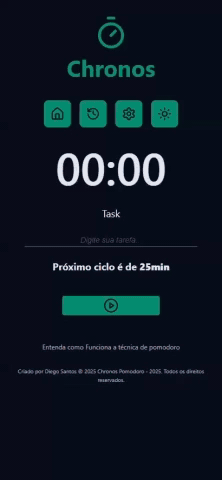
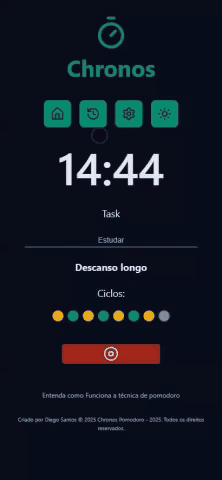
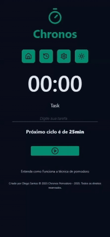

<div align="center">
  
  <h1>Chronos Pomodoro</h1>
</div>

**Chronos Pomodoro** é um aplicativo de produtividade baseado na Técnica Pomodoro. Ele permite que você alterne entre ciclos de foco e descanso de forma eficiente, com interface clara, responsiva e configurável.

---

## 🔗 Acesse o Projeto

➡️ [Deploy via Vercel](https://pomodoro-project-sepia.vercel.app)

---

## 📸 Demonstração

<div style="display: flex; flex-wrap: wrap; justify-content: center; gap: 20px;">

  <div style="flex: 1 1 300px; max-width: 300px; text-align: left;">
    <div style="padding: 10px 0;">
      <strong>🏠 Página Inicial e Criar Primeira Tarefa</strong>
    </div>
    
  </div>

  <div style="flex: 1 1 300px; max-width: 300px; text-align: left;">
    <div style="padding: 10px 0;">
      <strong>🧾 Histórico e Exclusão de Tarefas</strong>
    </div>
    
  </div>

</div>

<div style="display: flex; flex-wrap: wrap; justify-content: center; gap: 20px; margin-top: 10px;">

  <div style="flex: 1 1 300px; max-width: 300px; text-align: left;">
    <div style="padding: 10px 0;">
      <strong>⚙️ Configurações de Tempo de Cada Ciclo</strong>
    </div>
    
  </div>

  <div style="flex: 1 1 300px; max-width: 300px; text-align: left;">
    <div style="padding: 10px 0;">
      <strong>🌗 Modo Claro e Técnica Pomodoro</strong>
    </div>
    
  </div>

</div>


---

## 🚀 Funcionalidades

- Temporizador Pomodoro com três modos: foco, pausa curta e pausa longa
- Configuração personalizada de duração dos ciclos
- Histórico de tarefas criadas e concluídas
- Exclusão e reset de tarefas
- Modo escuro/claro com armazenamento de preferência
- Persistência com `localStorage`
- Contagem de tempo utilizando `Web Worker`
- Totalmente responsivo

---

## 🧰 Tecnologias Utilizadas

<p align="left">
  
  
  
  
  
  
</p>

---

## ▶️ Como Rodar Localmente

```bash
git clone https://github.com/diegosantos-engtads/pomodoro-project.git
cd pomodoro-project
npm install
npm run dev
